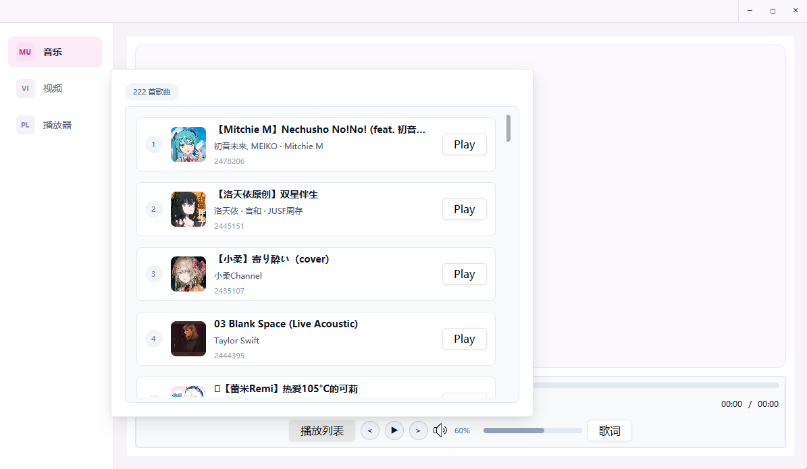
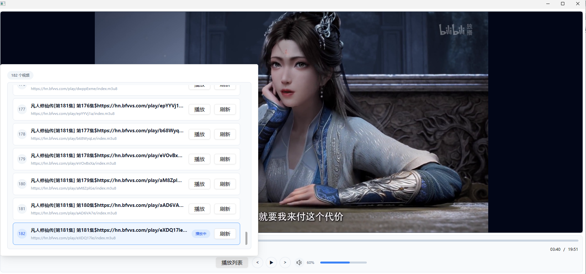

```aiignore
这是一个基于 GPUI + GStreamer 实现的音乐播放器和视频播放器。


本地视频：MP4、MOV、M4V、3GP、MKV、WebM、AVI、FLV
本地音频：MP3、AAC/M4A、FLAC、WAV、OGG

网络直播协议：
HLS（m3u8）、DASH
RTSP、RTMP、WebRTC
SRT、RIST、UDP/RTP
HTTP/HTTPS

支持手动输入网络链接或拖拽本地媒体播放。

比如
https://live.zbds.top/tv/iptv4.txt
https://github.com/youhunwl/TVAPP

视频来源 都是网络上的cms 站点 src/plugins/extractor 如果你有更好的资源可以让ai 接入

开发阶段需要 下载gst的c代码环境 
https://gstreamer.freedesktop.org/download/

由于构建需要裁减c 的dll 打包比较麻烦 
windows 构建
    cargo run --release -p build_windows -- doctor
    cargo run --release -p build_windows -- package --force
    cargo run --release -p build_windows -- verify
    cargo run --release -p build_windows -- support


cli 构建 actions
    gh workflow run build-windows.yml --ref master
    
web 构建
    Build Windows Package → 进入工作流详情页 → 右上角点击 Run workflow → 选择 master → 点击绿色 Run workflow。


```





