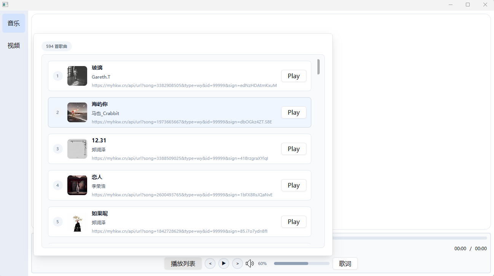
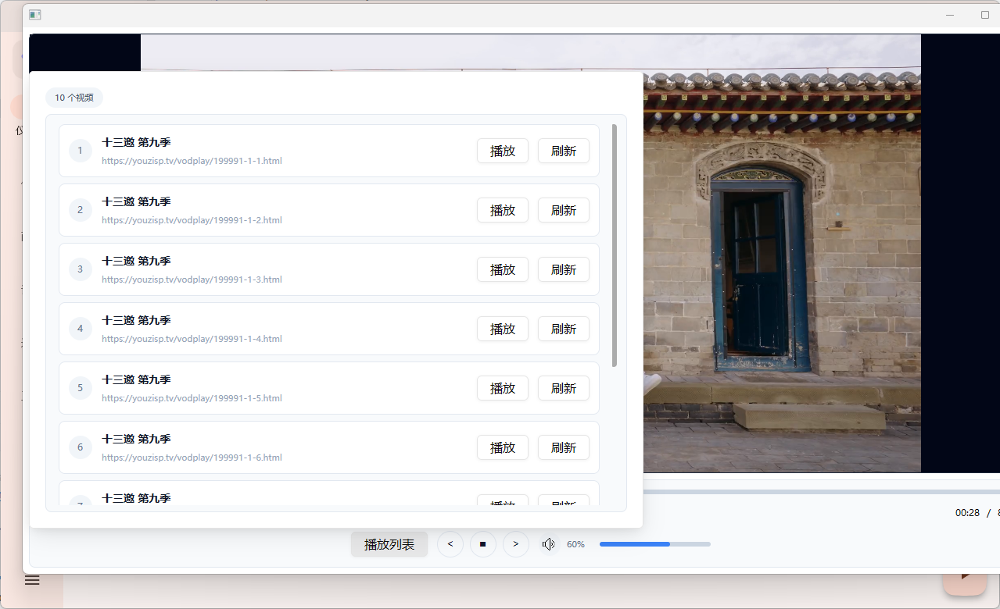

```aiignore
这是一个基于gpui + gst 实现的 音乐播放器和视频播放器 
支持网络直播 视频 tv  
hls m3u8 flv 等等 能手动输入网络链接 或者本地拖拽 播放 构建在actions 里面 

比如
https://github.com/youhunwl/TVAPP
https://raw.githubusercontent.com/YanG-1989/m3u/main/Gather.m3u

视频来源 都是网络上的cms 站点 src/plugins/extractor 如果你有更好的资源可以让ai 接入

开发阶段需要 下载gst的c代码环境 
https://gstreamer.freedesktop.org/download/

cargo run --release -p build_windows -- doctor
cargo run --release -p build_windows -- package --force
cargo run --release -p build_windows -- verify
cargo run --release -p build_windows -- support


```





